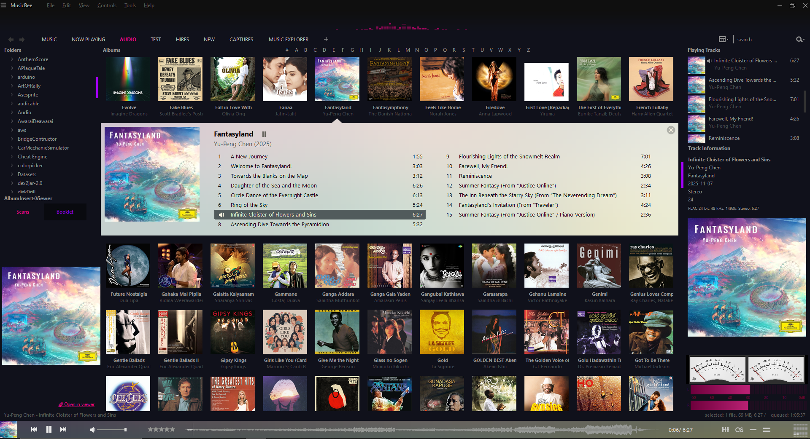
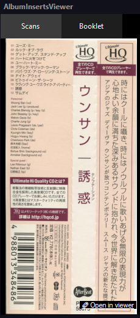
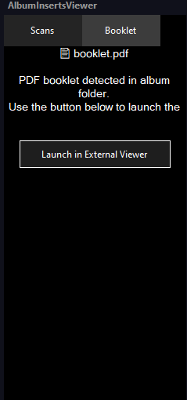
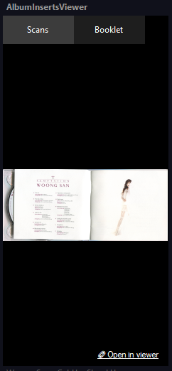
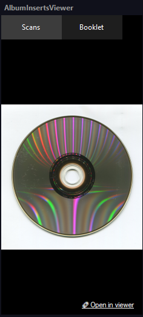

# AlbumInsertsViewer 
### A MusicBee Plugin for Viewing Album Inserts and Booklets

I've always wanted a way to view album inserts, scanned booklets, and PDFs directly inside MusicBee. It always felt like such a missed opportunity that the beautiful scans were hidden away and only accessible through the file browser—something most people rarely use. So, I created AlbumInsertsViewer to solve that problem.

This plugin lets you easily view album artwork, booklets, and inserts right within MusicBee, making the music experience even better. Experience your liner notes and artwork the way they were meant to be enjoyed—seamlessly integrated with your music.

[](./LICENSE)
[](https://getmusicbee.com/to/be/updated)
[](https://github.com/ShamalLakshan/AlbumInsertsViewer/stargazers)

> **⭐ Enjoying this plugin? Please consider [giving it a star](https://github.com/ShamalLakshan/AlbumInsertsViewer/stargazers)! It helps others discover it and motivates continued development. Your support means a lot!**

## ✨ Features

- 🖼️ **Automatic Image Slideshow** - Displays all images found in your album folders
- 📚 **PDF Booklet Detection** - Automatically finds and displays PDF liner notes
- 📌 **Dockable Panel** - Integrates seamlessly into MusicBee's interface
- 🪟 **Floating Window** - Also works as a standalone draggable window
- 🔄 **Smart Search** - Recursively searches subdirectories for scans
- 🎯 **Fallback Support** - Uses embedded artwork when no files are found
- ⚙️ **Highly Configurable** - Customize colors, slideshow timing, and more

## 📹 Demo

<iframe width="560" height="315" src="https://www.youtube.com/embed/Lxa9jI8LnxE?si=n2Qdn84uV_rOmf4N" title="YouTube video player" frameborder="0" allow="accelerometer; autoplay; clipboard-write; encrypted-media; gyroscope; picture-in-picture; web-share" referrerpolicy="strict-origin-when-cross-origin" allowfullscreen></iframe>

## 📸 Screenshots



<div align="center">
    
    
    
    
</div>


## 🚀 Quick Start

### Installation

1. **Download** the latest `AlbumInsertsViewer.dll` from the [Releases](https://github.com/ShamalLakshan/AlbumInsertsViewer/releases) page
2. **Copy** it to your MusicBee plugins folder:
   ```
   C:\Program Files (x86)\MusicBee\Plugins\
   ```
3. **Restart** MusicBee
4. **Open** the viewer from the menu: `View → Album Inserts Viewer`

**Requirements**: Windows, MusicBee 3.0+, .NET Framework 4.8

## 🎮 Usage

### Basic Usage

1. Play any track in MusicBee
2. The plugin automatically loads images from the album folder
3. Switch between **Scans** and **Booklet** tabs to view images or PDFs
4. Images cycle automatically (if multiple images exist)
5. Click on any image to open it in your default viewer

### Dockable Panel

To dock the plugin in MusicBee:
1. Go to `View → Arrange Panels → Drag the "album inserts viewer" to any panel of you preference`
2. It should display when you Save and Apply changes.

### Floating Window

Open from `View → Album Inserts Viewer` for a standalone draggable window.

## ⚙️ Configuration

### First Use

The plugin automatically creates a configuration file on first run at:
```
C:\Users\[YourUsername]\AppData\Roaming\MusicBee\albuminsertsviewer.colors.conf
```
To access this file, press Win+R and paste: `%appdata%\MusicBee\`

The configuration file is located at:
```
C:\Users\[YourUsername]\AppData\Roaming\MusicBee\albuminsertsviewer.colors.conf
```
The documentation for the config file can be found at : [config.md](./config.md)


## 📁 File Organization

The plugin searches for these files in your album folders:
- **Images**: `.jpg`, `.jpeg`, `.png`, `.bmp`, `.gif`
- **PDFs**: `.pdf` (liner notes, booklets, etc.)

Files can be in the main album folder or any subdirectory like:
- `Album/Scans/`
- `Album/Artwork/`
- `Album/Booklet/`

The plugin automatically searches all subdirectories recursively.

## 🛠️ Building from Source

```bash
# Clone the repository
git clone https://github.com/ShamalLakshan/AlbumInsertsViewer.git
cd AlbumInsertsViewer

# Open in Visual Studio
AlbumInsertsViewer.sln

# Add reference to MusicBeePlugin.dll from your MusicBee installation
# Build in Release mode
# Copy output DLL to MusicBee Plugins folder
```

## 📋 Project Structure

```
AlbumInsertsViewer/
├── AlbumInsertsViewer.cs      # Main plugin logic and MusicBee integration
├── AlbumInsertsPanel.cs       # Dockable panel implementation
├── Form1.cs                   # Floating window logic
├── Form1.Designer.cs          # UI component initialization
├── Form1.resx                 # UI resources
└── MusicBeeInterface.cs       # MusicBee API interface
```

## 🐛 Known Issues

- **PDF Viewing**: Currently opens PDFs in external applications. Native PDF viewer support is planned for a future release.
See [Issues](https://github.com/ShamalLakshan/AlbumInsertsViewer/issues) for more details and workarounds.

## 🤝 Contributing

Contributions are welcome! Feel free to submit bug reports, feature requests, or pull requests through the [Issues](https://github.com/ShamalLakshan/AlbumInsertsViewer/issues) page.

## 📄 License

This project is licensed under the MIT License - see the [LICENSE](./LICENSE) file for details.

## 💬 Support

- **Bug reports**: [Open an issue](https://github.com/ShamalLakshan/AlbumInsertsViewer/issues)
- **Feature requests**: [Open an issue](https://github.com/ShamalLakshan/AlbumInsertsViewer/issues)
- **Questions**: Check existing issues or start a discussion

## 🙏 Acknowledgments

- MusicBee community for feedback and testing
- All contributors who help improve this plugin

## ⭐ Show Your Support

**Enjoying AlbumInsertsViewer?** If this plugin has enhanced your music listening experience, please consider giving it a star! ⭐

**[⭐ Star this repository](https://github.com/ShamalLakshan/AlbumInsertsViewer/stargazers)** — It takes just a second and helps in so many ways:
- 🔍 Helps other MusicBee users discover this plugin
- 💪 Motivates me to keep developing and improving the plugin
- 📊 Shows that people find this useful
- 🙏 Your appreciation is the best reward for open-source work!

**Every star matters and genuinely encourages me to dedicate more time to this project!**

You can also:
- 🐛 Report bugs you encounter
- 💡 Suggest new features
- 🔄 Share with other MusicBee users

---

**Made with ❤️ for the MusicBee community**